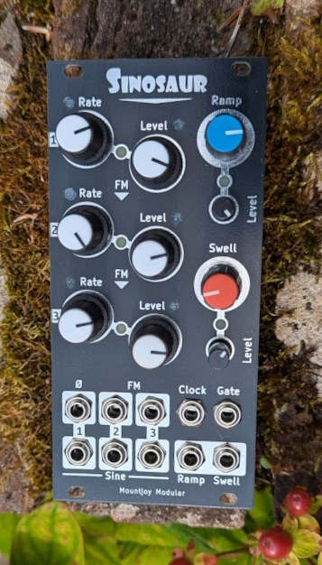

# Sinosaur

## Overview

Sinosaur is an LFO and simple envelope generator for use in a Eurorack modular synthesiser. Two envlopes are available: a ramp and a swell, each with a speed and a level control. Each of the sine waves has a rate and level control both of which can be controlled with either envelope.

Sine 1 has a normal output and a phase inverted output. Sines 2 and 3 have a normal output and an FM output, which is derived from the preceding sine wave. Clicking the sine wave's rate or level potentiometer switches the ramp or swell envelopes on for that control. An LED cycles between blue (ramp control), red (swell control) or off to show envelope control.

If a sine's rate is controlled by the ramp, then the rate of the sine wave will increase from its slowest rate up to the rate selected by the potentiometer. In swell mode the rate will increase to the potentiometer level and then fade back to its slowest rate. Envelope control over the sine wave's level works similarly.

A gate input controls the start of the ramp and swell envelopes. The ramp will increase to its selected level whilst the gate is high and then rapidly decrease to zero. The swell rise and fall times are jointly set by the swell potentiometer, with the fall time twice as slow as the rise time.

A clock input is also available to limit the sine wave rates to multiples and divisions of the clock. Changing the rate (either with the potentiometer or envelope) selects from 8x, 4x, 2x, 1, 0.5x and 0.25x the clock rate.

## Outputs

Outputs range from 0V to 6.6V. The level control of the sine waves amplifies from 0v up to a 0V - 6.6V level (ie unipolar rather than bipolar around a central level). The inverted sine's level is 6.6V when the level control is at zero and increases to a maximum swing of 6.6V to 0V.

The levels of the envlopes and sine waves is displayed using LEDs (blue for ramp, orange for swell and white for sine waves).

## Technical

The module is based around an STM32G473 microcontroller, clocked at 170MHz. The various sine wave and envelopes are all generated internally by one of the microcontroller's seven 12 bit DACs.

TL074 quad op-amps are used to amplify (and/or phase invert) the outputs from 3.3V to 6.6V at maximum.

The level LEDs are controlled by PWM by hardware Timer channels on the microcontroller. Clock and Gate inputs are protected with transistor voltage limiters.

The module is designed to support USB input but this is unused at present.

[Components schematic](Hardware/Sinosaur_Components.pdf)

[Controls schematic](Hardware/Sinosaur_Controls.pdf)

## Power

Power is supplied via a 3.3V LDO regulator.

- +12V current draw: 90 mA
- -12V Current draw: 14 mA

## Errata

The inverted output of sine 1 will produce a -6.6V to 0V signal. As detailed on the component schematic a resistor is added to mix in the -12V signal raising the output to 0 - 6.6N.

This is still not ideal as at a zero level the inverted output is at 6.6V. No obvious solution available other than adding an additional DAC.